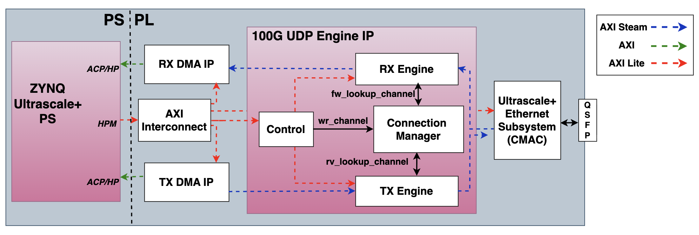
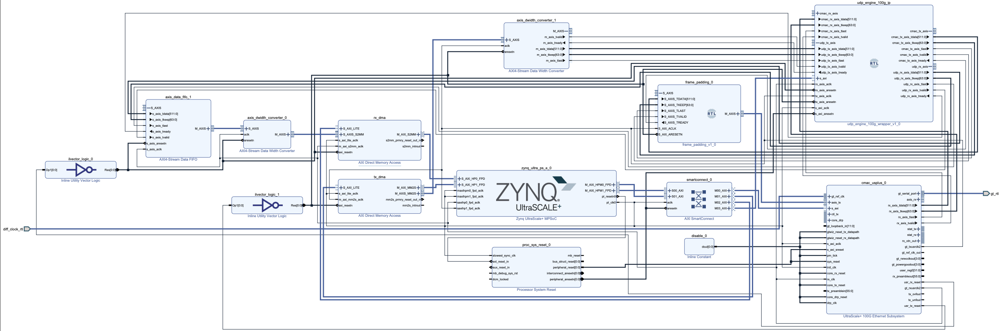

# ZeusUDP: A Near-Memory 100Gbps FPGA UDP Engine for Ultra-Low-Latency Networking

##### Network applications are increasingly critical in distributed systems, cloud services, space systems, high-frequency trading, and emerging edge-AI preprocessing workloads. Offloading the network stack from the CPU using accelerators and SmartNIC-like architectures—together with techniques such as RDMA—has become an effective strategy for achieving low latency and high throughput. In this work, we design and implement a low-latency 100\,Gb/s Ethernet UDP Engine IP on an AMD UltraScale+ SoC. The engine leverages the QSFP28 interface and the hardened UltraScale+ 100\,Gb/s Ethernet subsystem on the RFSoC, providing packet construction for transmission, packet filtering for received data, and a connection-management unit for bind/unbind bookkeeping. The engine is controlled by the Application Processing Unit (APU) of the Zynq UltraScale+ MPSoC through an AXI interface, and transfers packet payloads via DMA through both the non-coherent High-Performance (HP) ports and the low-latency Accelerator Coherency Port (ACP), which provides coherent access to the APU’s snooping cache subsystem. This architecture enables one of the closest and lowest-latency Ethernet offload paths available to the processor.

### High Level Diagram

<!-- ### Paper Link: () -->

### [Vivado Project](./vivado_project/)

